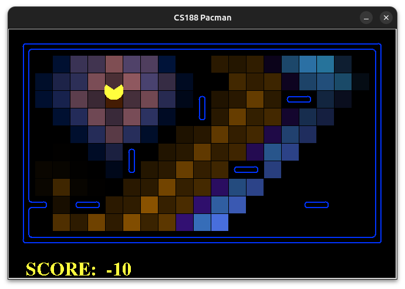
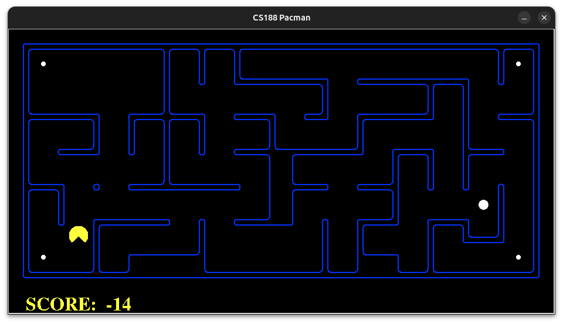
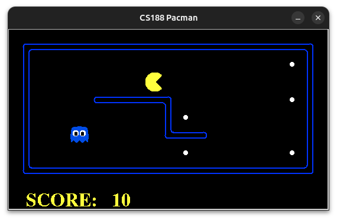

# 🕹️ Basic AI algorithm in Python for Pacgman game


<div style="display: flex; justify-content: space-around; align-items: center;">
  
</div>

Project undertaken as part of the INFO8006 course instructed by Professor Louppe.<br>
Marks :
- Project 1 - A* : 16/20
- Project 2 - Minimax and h-minimax : 19/20
- Project 3 - Bayes filter : 20/20

Note : No copying (even partial) of this code within the scope of the INFO8006 course will be tolerated.

## Summary
0. [Installation](#installation)
1. [Project 1 - A*](#projet-1)
2. [Project 2 - Minimax](#projet-2)
3. [Project 3 - Bayes filter](#projet-3)
4. [Credits](#credits)

## Installation
This section is taken from the [project page](https://github.com/glouppe/info8006-introduction-to-ai/tree/master/projects#readme) of the INFO8006 course.<br>
- Install [conda](https://docs.anaconda.com/free/miniconda/)
- Create a conda environment to run the programs, activate it and install numpy
```console
conda create --name pacman python=3.8
conda activate pacman
conda install numpy
```
- Clone the repository
```console
git clone git@github.com:sgardier/Pacman_IA.git
```

## Project 1
<div style="display: flex; justify-content: space-around; align-items: center;">
  
</div>
The first project involves developing a pathfinding algorithm to eat all the dots while minimizing the total distance traveled.

### BFS solution
This solution make use of [Breadth-First search](https://en.wikipedia.org/wiki/Breadth-first_search) to find the direction to the nearest dot.

Run it (from the projet-1 folder)
```console
python run.py --agent bfs --layout medium
```
Multiple layout are available : small, medium, large

### A* solution
This solution make use of [A*](https://en.wikipedia.org/wiki/A*_search_algorithm) to find the direction to the nearest dot which minimizes our heuristic.<br>
In our solution the heuristic to compute the forward cost is the Manhattan distance between the position and the farthest food point from this position.

Run it (from the projet-1 folder)
```console
python run.py --agent astar --layout medium
```
Multiple layout are available : small, medium, large

## Project 2
<div style="display: flex; justify-content: space-around; align-items: center;">
  
</div>
The second project involves developing a algorithm which which maximizes the score value.<br>
Eating the food, eating a ghost and winning the map give points (+10, +5, +500) while walking, eating the capsules and losing the game takes away points (-1, -5, -500).

### Minimax
This solution is a direct implementation of [minimax](https://en.wikipedia.org/wiki/Minimax).

Run it (from the projet-2 folder)
```console
python run.py --agent minimax --ghost dumby --layout small_adv
```
Since Minimax is a computation intensive algorithm we recommend to try only the small layout<br>
Multiple ghost behaviors are available : dumby, greedy, smarty

### H-Minimax
This solution is a variant of [minimax](https://en.wikipedia.org/wiki/Minimax) called h-minimax.<br>
H-minimax reduces the required computation to find a solution by adding a maximum recursion count and an heuristic.<br>
When the maximum recursion is reached, the score given to the action =<br>
score at recursion state reached - shotest path to all remaining foods at recursion state reached - exp(number of previous walkthrough at the position in the recursion state)

Run it (from the projet-2 folder)
```console
python run.py --agent minimax --ghost dumby --layout small_adv
```
Multiple ghost behaviors are available : small_adv, medium_adv, large_adv

## Project 3
<div style="display: flex; justify-content: space-around; align-items: center;">
  
</div>
The third project involves implementing a [Bayes filter](https://en.wikipedia.org/wiki/Recursive_Bayesian_estimation) over noisy reading of the ghost positions.<br>
Here the goal of pacman is to eat all the ghosts in a minimum number steps while having only access to a noisy manhattan distance to each remaining ghost.

Run it (from the projet-3 folder)
```console
python run.py --ghost afraid --nghosts 1 --layout large_filter --seed 19
```

## Credits
- [Simon Gardier](https://github.com/sgardier) (Co-author)
- Jamama Jair (Co-author)
- Dario Rinallo (Co-author)
